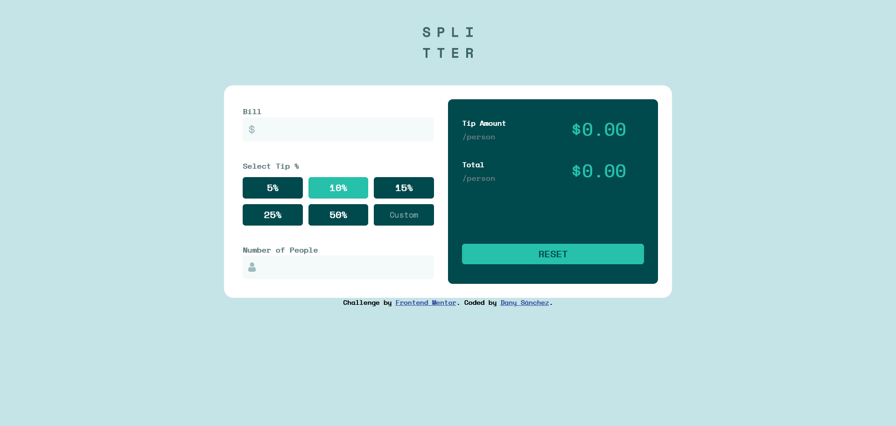
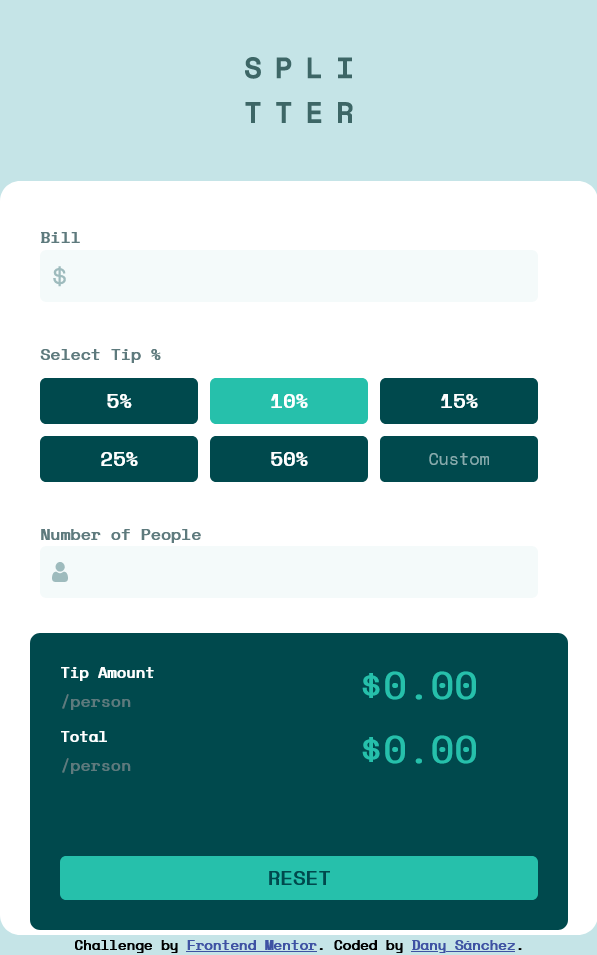

# Frontend Mentor - Tip calculator app solution

This is a solution to the [Tip calculator app challenge on Frontend Mentor](https://www.frontendmentor.io/challenges/tip-calculator-app-ugJNGbJUX). Frontend Mentor challenges help you improve your coding skills by building realistic projects.

## Table of contents

- [Overview](#overview)
  - [The challenge](#the-challenge)
  - [Screenshot](#screenshot)
  - [Links](#links)
- [My process](#my-process)
  - [Built with](#built-with)
  - [What I learned](#what-i-learned)
- [Author](#author)
- [Acknowledgments](#acknowledgments)

## Overview

### The challenge

Users should be able to:

- View the optimal layout for the app depending on their device's screen size
- See hover states for all interactive elements on the page
- Calculate the correct tip and total cost of the bill per person

### Screenshot

### Links

- Solution URL: (https://github.com/danyrszz/tip-calculator-vanillaJS)
- Live Site URL: (https://danyrszz.github.io/tip-calculator-vanillaJS/)

## My process

### Built with

- Semantic HTML5 markup
- CSS custom properties
- Flexbox
- CSS Grid
- Desktop-first workflow
- Vanilla JS

### What I learned

This helped me to understand quite a bit more the event listeners, first i was wondering how to make the label to be updated as the user types (and obviously perform the calculations), i got a little stuck here.
First i tried to use keyboard events, but i wasn't satisfied with the result, then i tought "maybe with some kind of 'change' event, to look for any changes on the state of the element". Then i found the "input" event which basically do what i was looking for. The rest was pretty easy. 

Oh by the way it's the first time -in the few projects i've done this far- using media queries!, and i'm still learning grid and flexbox, those two are amazing for laying out!!

## Author

- [Daniel Sánchez]
- Frontend Mentor - [@yourusername](https://www.frontendmentor.io/profile/yourusername)
- Twitter - [@yourusername](https://www.twitter.com/yourusername)

## Acknowledgments

Definetely will be looking up more on different types of event listeners! i'll be looking up for more challenges that require more than just clicks :) 

